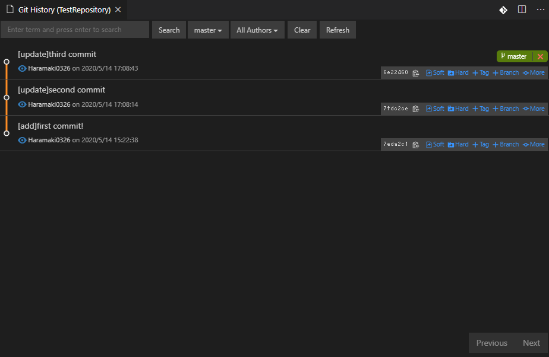
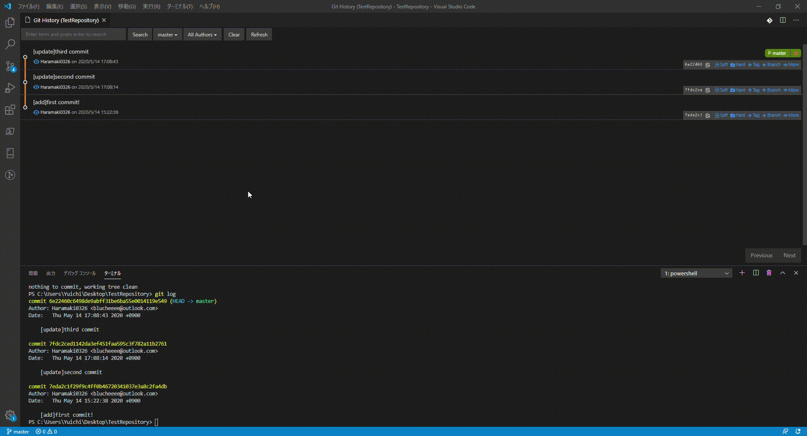
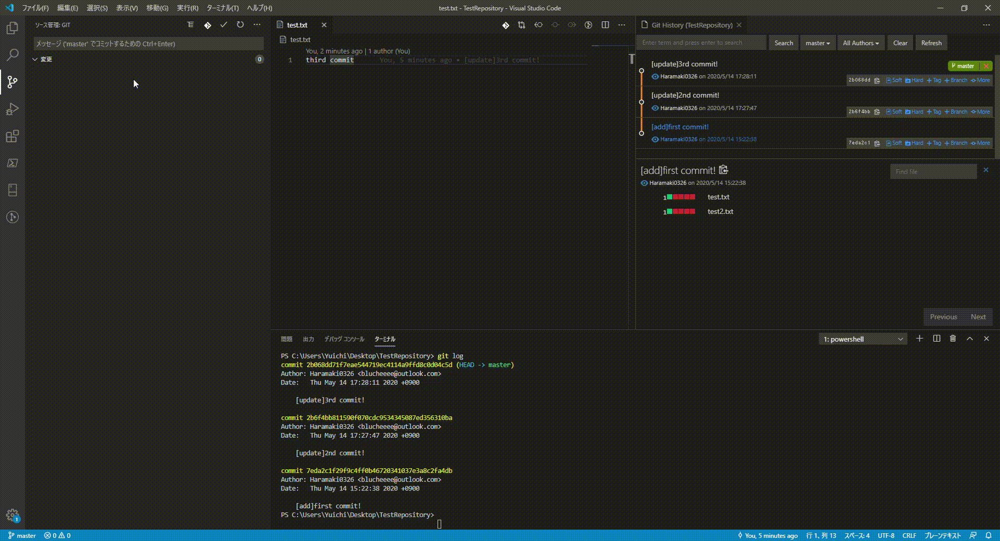
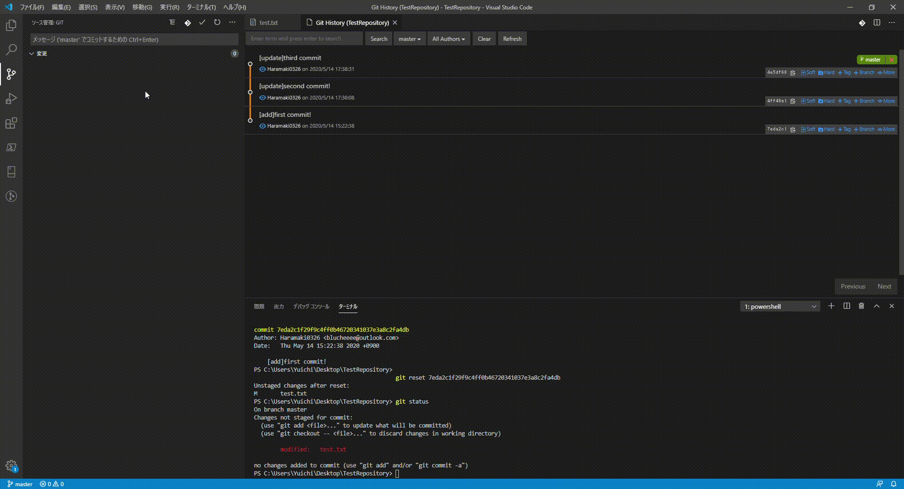

# [Git]Reset(Hard,Mixed,Soft)
## 参考
[[git reset (--hard/--soft)]ワーキングツリー、インデックス、HEADを使いこなす方法 - Qiita](https://qiita.com/shuntaro_tamura/items/db1aef9cf9d78db50ffe)

## `reset`と`revert`の違い
- `reset`：削除履歴を残さない
- `revert`：削除履歴を残す（打ち消しコミットを作成する）

## 概要
- リンク先の記事が分かりやすいのでこれを読む
- Gitのレベルには以下の3つがある。
  1. ワーキングツリー
  2. インデックス（stage）
  3. HEAD(コミット)
- `add`:1→2
- `commit`:2→3
- `git reset`には`--hard`、`--mixed`、`--soft`の3つのオプションがある。
  - `--hard`：「HEADの位置・インデックス・ワーキングツリー」全て
  - `--mixed（or オプション無し）`：「HEADの位置・インデックス」
  - `--soft`：「HEADの位置」のみ

## 実際の操作
### 操作前状況
- コミットを3つ作成（コミットメッセージがそれぞれ：first commit, second commit, third commit）

### `Reset --hard`
- 最初のコミットに`Reset --hard`する
- すなわち、以下すべてを最初のコミット時に戻す
  1. ワーキングツリー >> `first commit`
  2. インデックス（stage）>> `first commit`
  3. HEAD(コミット) >> `first commit`

### `Reset --mixed（or オプション無し）`
- 最初のコミットに`Reset --mixed（or オプション無し）`する
- すなわち、インデックスとコミットを`first commit`に戻す。
  1. ワーキングツリー >> `third commit`
  2. インデックス（stage）>> `first commit`
  3. HEAD(コミット) >> `first commit`

### `Reset --soft`
- 最初のコミットに`Reset --soft`する
- すなわち、コミットのみを`first commit`に戻す。
  1. ワーキングツリー >> `third commit`
  2. インデックス（stage）>> `third commit`
  3. HEAD(コミット) >> `first commit`
