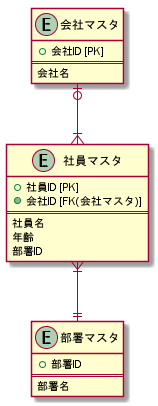

# 『ドメイン駆動設計入門』メモ
## 概要
### 知識を表現するパターン
- 値オブジェクト
- エンティティ
- ドメインサービス

### アプリケーションを実現するためのパターン
- リポジトリ
- アプリケーションサービス
- ファクトリ

### 知識を表現する、より発展的なパターン
- 集約
- 仕様

### 値オブジェクトとエンティティの違い
- 値オブジェクト
  - 不変
  - 属性で区別する
  - ライフサイクルをもたない

- エンティティ
  - 可変
  - 同一性によって区別（識別子をもつ）
  - ライフサイクルをもつ


### ドメインサービス
- 値オブジェクトやエンティティに書くと不自然なふるまいを担当（例、ユーザ重複チェック）
- ドメインサービスには何でも書けるが濫用するとドメインモデル貧血症を起こす


## 値オブジェクト
### 不変である
``` cs
// 「値の変更」を行う疑似コード
var greet = "こんにちは";
greet.ChangeTo("Hello");    //このようなメソッドは本来存在しない。
Console.WriteLine(greet);   //Hello が表示される
```
このコードが許されるならば下記も許される。
``` cs
// 「値の変更」を行う疑似コード
"こんにちは".ChangeTo("Hello");    //このようなメソッドは本来存在しない。
Console.WriteLine("こんにちは");   //Hello が表示される
```
→値が変更されると上記のような困難がある。
→値は不変だからこそ安心して使える。

``` cs
// 一般的に見られる値の変更
var fullName = new FullName("tarou", "yamada")
fullName.ChangeLastName("sato");
```
上記のコードも値を直接変更している。
→**値を変更する`ChangeTo`や`ChangeLastName`のようなメソッドは値クラスに定義されるべきではない。**

### 交換が可能である
値が不変だからといって変更できないのは困る。（矛盾しているようだが矛盾ではない！）
→**代入（交換）によってのみ変更が可能！**
``` cs
// 普段行っている値の変更
var num = 0;
num = 1;

var greet = "こんにちは";
greet = "Hello!";
```
``` cs
// 値オブジェクトの変更
var fullName = new FullName("tarou", "yamada")
fullName = new FullName("tarou","sato");
```


### 等価性によって比較される
### 値オブジェクトにIEquatable<T>を実装する理由
- 値オブジェクトはクラスである
- すべてのクラスはObjectクラスを継承している
- そのためObjectクラスのEqualsメソッドを使用できる
`bool IEquatable(object obj)`

- しかし以下の3点から使用するべきではない
  - 引数がobject型であるように型が異なるもの同士で比較できてしまう（本来はエラーにしたい）
  - ボクシングが発生しパフォーマンスが悪い
  - クラスは同値性ではなく同一性で等価性が判定される

- つまり、ObjectクラスのEqualsメソッドは同一インスタンスを参照しているときのみtrueとなる。同一属性をもっていてもインスタンスが異なればfalseとなる。

- そこで**値オブジェクトの場合は同値性で等価性が判定されるので`IEquatable<T>`を実装するべき。**
- 逆に**エンティティは同一性で等価性が判定されるので`IEquatable<T>`は実装するべきではない。**
- VisualStudioで`IEquatable<T>`は自動実装できるのでそれを使う（以下のコードは自動実装によるもの）

``` cs
using System;

public class Hello
{
    public static void Main()
    {
        //値オブジェクトであるFullNameは同値性で等価性を判定される
        var name1 = new FullName("a", "b");
        var name2 = new FullName("a", "b");
        var result = name1.Equals(name2);

        //True
        Console.WriteLine(result);


        //エンティティであるUserは同一性で等価性を判定される
        var user1 = new User(new FullName("yamada","taro"),28);
        var user2 = new User(new FullName("yamada","taro"),28);
        var result2 = user1.Equals(user2);

        //False
        Console.WriteLine(result2);
    }
}

public class FullName : IEquatable<FullName>
{
    public string FirstName { get; }
    public string LastName { get; }

    public FullName(string firstName, string lastName)
    {
        this.FirstName = firstName;
        this.LastName = lastName;
    }

    public override bool Equals(object obj)
    {
        return Equals(obj as FullName);
    }

    public bool Equals(FullName other)
    {
        return other != null &&
               FirstName == other.FirstName &&
               LastName == other.LastName;
    }

    public override int GetHashCode()
    {
        return HashCode.Combine(FirstName, LastName);
    }
}

public class User
{
    public User(FullName fullName, int age)
    {
        this.FullName = fullName;
        this.Age = age;
    }

    public FullName FullName { get ;}
    public int Age { get; }
}
```
## エンティティ
## ドメインサービス

## リポジトリ
## アプリケーションサービス
## ファクトリ

## 集約
## 仕様


## Chapter 1ドメイン駆動設計とは
1.1ドメイン駆動設計とは何か
1.2ドメインの知識に焦点をあてた設計手法
1.3本書解説事項と目指すゴール
COLUMN｜ドメイン駆動設計の実践を難しくするもの
1.4本書で解説するパターンについて
COLUMN｜なぜいま、ドメイン駆動設計か

## Chapter 2システム固有の値を表現する「値オブジェクト」
2.1値オブジェクトとは
### 2.2 値の性質と値オブジェクトの実装
値オブジェクトの性質

### 不変である

### 交換が可能である

### 等価性によって比較される


COLUMN｜不変のメリット
2.3値オブジェクトにする基準
2.4ふるまいをもった値オブジェクト
2.5値オブジェクトを採用するモチベーション
2.6まとめ

## Chapter 3ライフサイクルのあるオブジェクト「エンティティ」
3.1エンティティとは
3.2エンティティの性質について
COLUMN｜セーフティネットとしての確認
3.3エンティティの判断基準としてのライフサイクルと連続性
3.4値オブジェクトとエンティティのどちらにもなりうるモデル
3.5ドメインオブジェクトを定義するメリット
3.6まとめ

## Chapter 4不自然さを解決する「ドメインサービス」
4.1サービスが指し示すもの
4.2ドメインサービスとは
4.3ドメインサービスの濫用が行き着く先
4.4エンティティや値オブジェクトと共にユースケースを組み立てる
COLUMN｜ドメインサービスの基準
4.5物流システムに見るドメインサービスの例
COLUMN｜ドメインサービスの命名規則
4.6まとめ

## Chapter 5データにまつわる処理を分離する「リポジトリ」
5.1リポジトリとは
COLUMN｜リポジトリはドメインオブジェクトを際立たせる
5.2リポジトリの責務
5.3リポジトリのインターフェース
COLUMN｜nullの是非とOption型
5.4SQLを利用したリポジトリを作成する
5.5テストによる確認
5.6テスト用のリポジトリを作成する
5.7オブジェクトリレーショナルマッパーを用いたリポジトリを作成する
5.8リポジトリに定義されるふるまい
5.9まとめ

## Chapter 6ユースケースを実現する「アプリケーションサービス」
6.1アプリケーションサービスとは
COLUMN｜アプリケーションサービスという名前
6.2ユースケースを組み立てる
COLUMN｜煩わしさを減らすために
COLUMN｜エラーかそれとも例外か
6.3ドメインのルールの流出
6.4アプリケーションサービスと凝集度
6.5アプリケーションサービスのインターフェース
6.6サービスとは何か
6.7まとめ

## Chapter 7柔軟性をもたらす依存関係のコントロール
7.1技術要素への依存がもたらすもの
7.2依存とは
7.3依存関係逆転の原則とは
### 7.4依存関係をコントロールする
参考URL
[Service LocatorとDependency InjectionパターンとDI Container - nuits.jp blog](https://www.nuits.jp/entry/servicelocator-vs-dependencyinjection)



#### Service Locatorパターン
#### Dependency Injectionパターン
#### DI Container
7.5まとめ

## Chapter 8ソフトウェアシステムを組み立てる
8.1ソフトウェアに求められるユーザーインターフェース
COLUMN｜ソフトウェアとアプリケーションの使い分け
8.2コマンドラインインターフェースに組み込んでみよう
COLUMN｜シングルトンパターンと誤解
8.3MVCフレームワークに組み込んでみよう
COLUMN｜コントローラの責務
8.4ユニットテストを書こう
8.5まとめ
COLUMN｜本当に稀な怪談話

## Chapter 9複雑な生成処理を行う「ファクトリ」
9.1ファクトリの目的
9.2採番処理をファクトリに実装した例の確認
COLUMN｜ファクトリの存在に気づかせる
9.3ファクトリとして機能するメソッド
9.4複雑な生成処理をカプセル化しよう
COLUMN｜ドメイン設計を完成させるために必要な要素
9.5まとめ

## Chapter 10データの整合性を保つ
10.1整合性とは
10.2致命的な不具合を確認する
10.3ユニークキー制約による防衛
10.4トランザクションによる防衛
COLUMN｜結局どれを使うべきか
10.5まとめ

## Chapter 11アプリケーションを1から組み立てる
11.1アプリケーションを組み立てるフロー
11.2題材とする機能
11.3サークルの知識やルールをオブジェクトとして準備する
11.4ユースケースを組み立てる
11.5まとめ

## Chapter 12ドメインのルールを守る「集約」
12.1集約とは
COLUMN｜集約を保持するコレクションを図に表すか
COLUMN｜よりきめ細やかなアクセス修飾子（Scala）
12.2集約をどう区切るか
COLUMN｜IDのゲッターに対する是非
12.3集約の大きさと操作の単位
COLUMN｜結果整合性
12.4言葉との齟齬を消す
12.5まとめ

## Chapter 13複雑な条件を表現する「仕様」
13.1仕様とは
13.2仕様とリポジトリを組み合わせる
COLUMN｜遅延実行による最適化
13.3まとめ

## Chapter 14アーキテクチャ
14.1アーキテクチャの役目
14.2アーキテクチャの解説
14.3まとめ

## Chapter 15ドメイン駆動設計のとびらを開こう
15.1軽量DDDに陥らないために
COLUMN｜パターンの濫用とパターンを捨てるとき
15.2ドメインエキスパートとモデリングをする
15.3ユビキタス言語
COLUMN｜ユビキタス言語と日本語の問題
15.4境界付けられたコンテキスト
15.5コンテキストマップ
15.6ボトムアップドメイン駆動設計
15.7まとめ