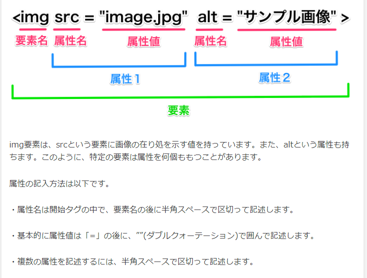
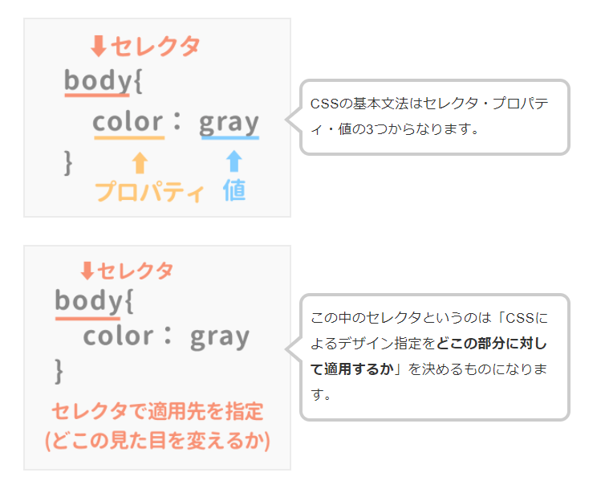
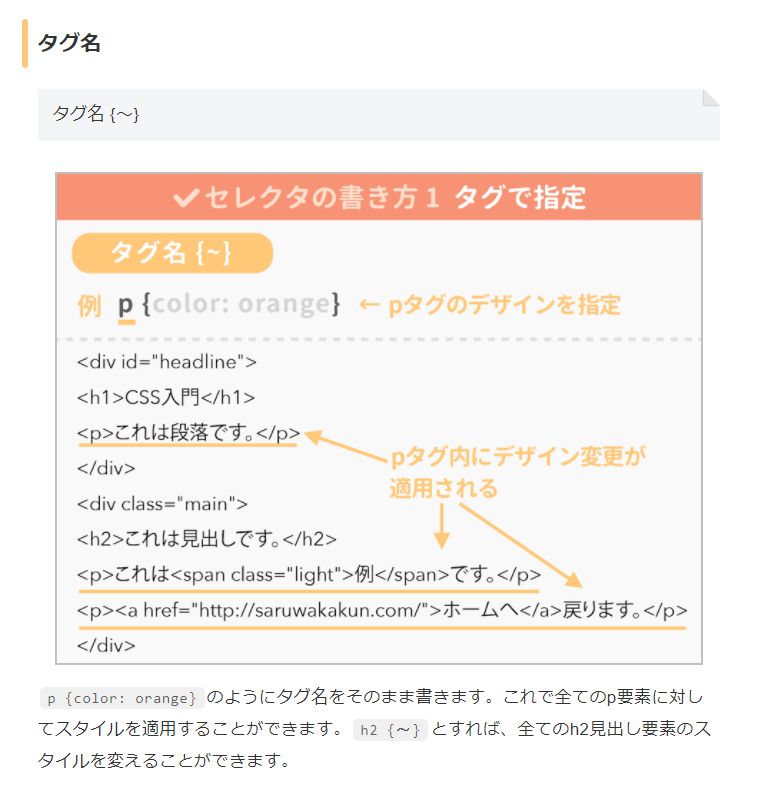
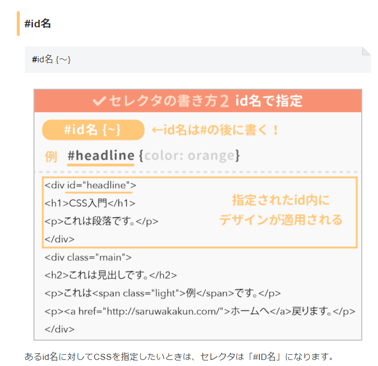
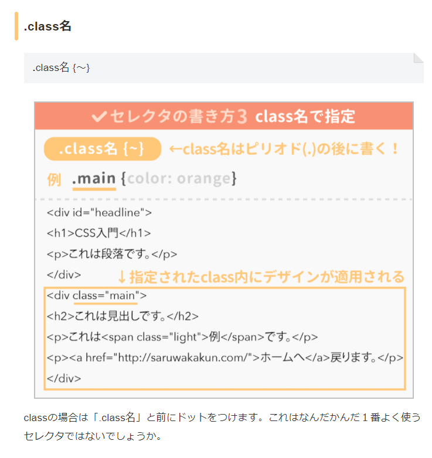
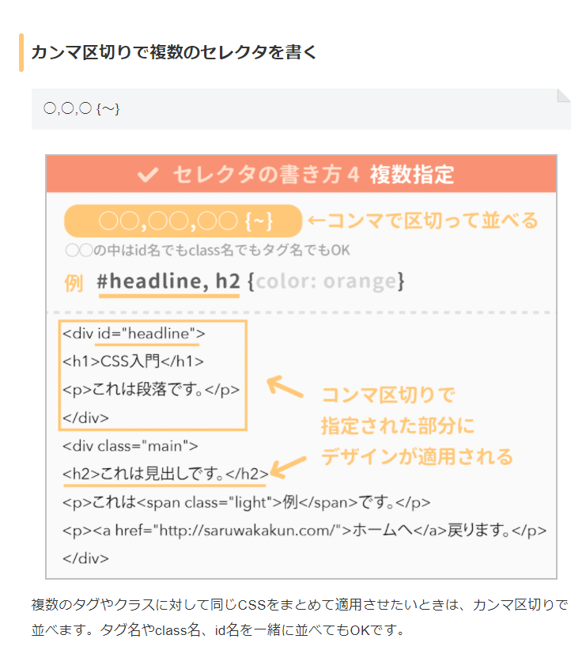
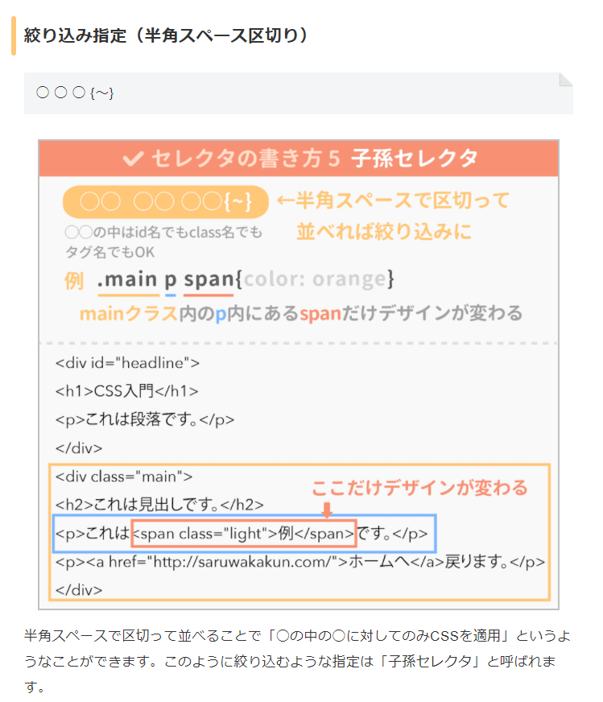

# HTML（要素・属性・属性値）と、CSS（セレクタ・プロパティ・値）について
## 参考
[CSSのセレクタとは？覚えておきたい25種類と書き方](https://saruwakakun.com/html-css/reference/selector)

## 説明
### HTMLとCSSの対応表
| HTML | CSS |
|---|---|
| 要素（タグ） | セレクタ |
| 属性 | プロパティ |
| 属性値 | 値 |

### 図解

